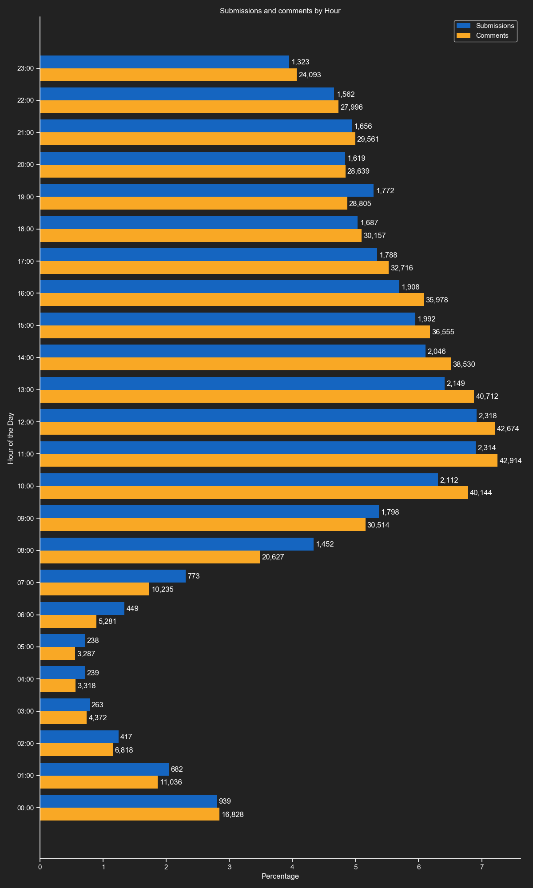
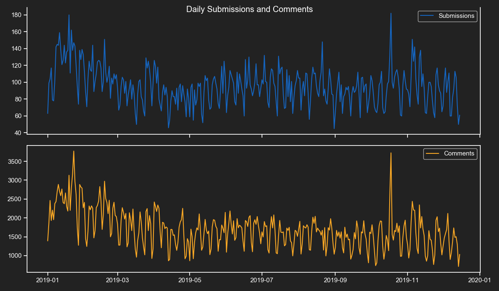
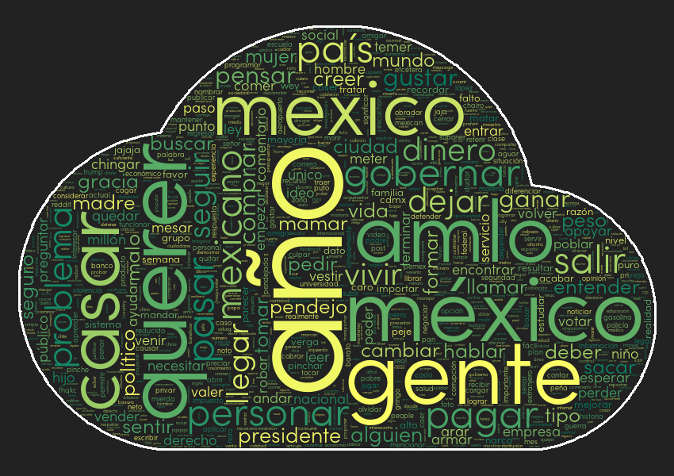
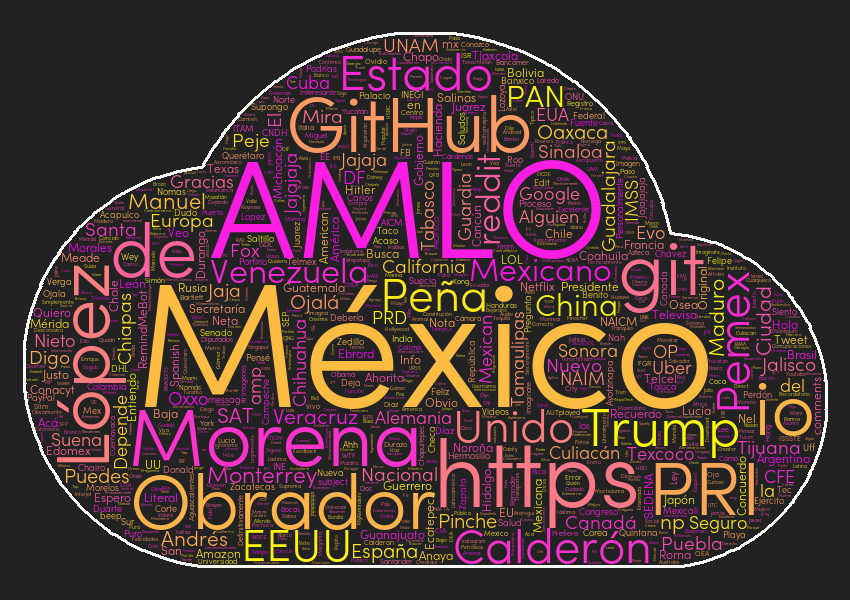

# Subreddit Analyzer

This project documents the process of downloading large amounts of `Reddit` submissions and comments using the `Pushshift` API to get interesting insights such as their distribution by weekday, hour and most common used words.

The project is divided in 3 main parts, the ETL process, the NLP pipeline and the generation of charts and insights.

The following are the summaries of the included scripts:

* subreddit_comments.py - A Python script that downloads a fixed amount of comments from the `Pushshift` API.

* subreddit_submissions.py - A Python script that downloads a fixed amount of submissions from the `Pushshift` API.

* subreddit_comments_alt.py - A Python script that downloads comments starting from the newest one to the first one of the specified date from the `Pushshift` API.

* subreddit_submissions_alt.py - A Python script that downloads submissions starting from the newest one to the first one of the specified date from the `Pushshift` API.

* step2.py - A Python script that uses `spaCy` to pass the downloaded comments into a NLP pipeline.

* step3.py - A Python script that generates several charts and insights from the submissions and comments datasets.

## Requirements

This project uses the following Python libraries

* requests - For querying the Pushshift API.
* spaCy : For passing the comments into a NLP pipeline.
* NumPy : For fast matrix operations.
* pandas : For analysing and getting insights from datasets.
* matplotlib : For creating graphs and plots.
* seaborn : For enhancing the style of matplotlib plots.
* word_cloud = For creating the word clouds.

## ETL Process

This project contains 2 ways of downloading submissions and commnets, by specifying a fixed amount or by specifying a target date.

The scripts allows you to specify any number of subreddits you desire.

```python
SUBREDDITS = ["mexico", "python", "learnpython"]
```

After that, you have the chance of specifying the number of submissions/comments or a target date.

```python
# Fixed amount version.
MAX_SUBMISSIONS = 10000

# Target date version.
# Year month and day.
TARGET_DATE = "2019-01-01"

TARGET_TIMESTAMP = datetime.fromisoformat(TARGET_DATE).timestamp()
```

*Note: These scripts use recursion to keep downloading data, it is required to set a new recursion limit. The following 2 lines of code wlil do that.*


```python
import sys

sys.setrecursionlimit(10000)
```

Now that we have our subreddits and targets defined we iterate over all the subreddits names and create their `csv.writer` objects.

```python
for subreddit in SUBREDDITS:

    writer = csv.writer(open("./{}-submissions.csv".format(subreddit),
                                "w", newline="", encoding="utf-8"))

    # Adding the header.
    writer.writerow(["datetime", "author", "title", "url", "domain"])

    print("Downloading:", subreddit)
    download_submissions(subreddit=subreddit)
    writer.writerows(SUBMISSIONS_LIST)

    SUBMISSIONS_LIST.clear()
```

For these scripts I like to recycle a global list to add all the submissions or comments data.

All csv files have the subreddit name as a prefix, this is to avoid overwritting files by accident.

In the next part we have the function that downloads the data, selects specific fields and calls itself if it finds more data.

```python
base_url = "https://api.pushshift.io/reddit/submission/search/"

params = {"subreddit": subreddit, "sort": "desc",
            "sort_type": "created_utc", "size": 500}

# After the first call of this function we will use the 'before' parameter.
if latest_timestamp != None:
    params["before"] = latest_timestamp

with requests.get(base_url, params=params, headers=HEADERS) as response:

    json_data = response.json()
    total_submissions = len(json_data["data"])
    latest_timestamp = 0

    print("Downloading: {} submissions".format(total_submissions))

    for item in json_data["data"]:

        # We will only take 3 properties, the timestamp, author and url.

        latest_timestamp = item["created_utc"]

        iso_date = datetime.fromtimestamp(latest_timestamp)
        tld = tldextract.extract(item["url"])
        domain = tld.domain + "." + tld.suffix

        if item["is_self"] == True:
            domain = "self-post"

        if domain == "youtu.be":
            domain = "youtube.com"

        if domain == "redd.it":
            domain = "reddit.com"

        SUBMISSIONS_LIST.append(
            [iso_date, item["author"], item["title"], item["url"], domain])

        if len(SUBMISSIONS_LIST) >= MAX_SUBMISSIONS:
            break

    if total_submissions < 500:
        print("No more results.")
    elif len(submissions_LIST) >= MAX_SUBMISSIONS:
        print("Download complete.")
    else:
        time.sleep(1.2)
        download_submissions(subreddit, latest_timestamp)
```

The function is simple enough, it sends parameters to the `Pushshift` API, iterates over the response and extracts the fields we need.

The domain extraction is only used in the `submissions` version.

The `comments` version has a few differences, the most important is the API endpoint, instead of:

`https://api.pushshift.io/reddit/submission/search/`

It uses:

`https://api.pushshift.io/reddit/comment/search/`

The other difference is that it retrieves the `body` field, which is the comment body.

Once you run the script and wait a few minutes you will have your datasets ready to be processed.

## NLP Pipeline

In this step we will use the comments dataset you have downloaded. Depending on the subreddit you chose it can weight more than 100 MB.

Before running the script you need to have installed the `spaCy` library and the language model of your choice.

In my case I downloaded comments from r/Mexico which is mainly a Spanish speaking subreddit.

I had to run this command on my CMD/Terminal:

`python -m spacy download es_core_news_sm`

If you are using another language you must go the following page and look for your appropiate command:

https://spacy.io/usage/models

Once you have downloaded your appropiate model we need to take a sample of comments from the dataset.

```python
comments_list = list()

for row in csv.DictReader(open("./mexico-comments.csv", "r", encoding="utf-8")):
    comments_list.append(row["body"])

# We take 50,000 random comments from the comments list.
corpus = random.sample(comments_list, 50000)

nlp = spacy.load("es_core_news_sm") # Don't forget to change it!
nlp.max_length = 10000000
```

*Note: This is a compute-intensive task, if your computer is not strong enough I advice to not run this script or use a small sample size.*

With our `corupus` ready we can start the NLP process.

```python
data_list = [["text", "text_lower", "lemma", "lemma_lower",
                "part_of_speech", "is_alphabet", "is_stopword"]]

for i in range(0, len(corpus), 1000):

    doc = nlp(" ".join(corpus[i:i+1000]))

    for token in doc:
        data_list.append([
            token.text, token.lower_, token.lemma_, token.lemma_.lower(),
            token.pos_, token.is_alpha, token.is_stop
        ])

with open("./tokens.csv", "w", encoding="utf-8", newline="") as tokens_file:
    csv.writer(tokens_file).writerows(data_list)
```

As you cna see, this is a very simple process, we take 1,000 comments at a time from the `corpus` and send them to the NLP pipeline.

We add the values we are interested in to a Python list and save that list to csv.

The entities process is exactly the same just with fewer data fields required.

At this point you will have two new csv files: `tokens.csv` and `entities.csv`.

Now we are ready to plot some graphs and get interesting insights.

## Data Analysis

For creating the plots we will use `seaborn` and `matplotlib`, the reason for this is that seaborn applies some subtle yet nice looking effects to the plots.

In this project we are going to use bar plots (1 horizontal and 1 vertical) and one line plot.

The first thing to do is to import the required libraries and to set some custom colors that will apply globally to each plot.

We will also define the file paths for our assets that will be used for the word clouds.

```python
import matplotlib.pyplot as plt
import numpy as np
import pandas as pd
import seaborn as sns
import wordcloud
from pandas.plotting import register_matplotlib_converters
from PIL import Image

register_matplotlib_converters()


sns.set(style="ticks",
    rc={
        "figure.figsize": [12, 7],
        "text.color": "white",
        "axes.labelcolor": "white",
        "axes.edgecolor": "white",
        "xtick.color": "white",
        "ytick.color": "white",
        "axes.facecolor": "#222222",
        "figure.facecolor": "#222222"}
    )


MASK_FILE = "./assets/cloud.png"
FONT_FILE = "./assets/sofiapro-light.otf"
EN_STOPWORDS = "./assets/stopwords-en.txt"
ES_STOPWORDS = "./assets/stopwords-es.txt"
```

With our style defined it is time to load up our datasets.

```python
df = pd.read_csv("mexico-submissions.csv",
                 parse_dates=["datetime"],
                 index_col=0)

df2 = pd.read_csv("mexico-comments.csv",
                  parse_dates=["datetime"],
                  index_col=0)
```

*Note: I included the datasets i used for my infographics in the data folder. The comments body were removed from the comments dataset for privacy reasons.*

It is very important to specify which column to treat as a date object and set it as our index. We are mostly working with time series data and this will make things much easier down the road.

## Exploratory Data Analysis

In this section we will get some interesting insights from our datasets.

*Note: If you are using a `Jupyter Notebook` or `IPython` you must reset your `DataFrames` since we redefine them very often.*

Let's start by taking a look at the head and tail of our `DataFrames`.

```python
df.head()
```

| | author | title | url | domain |
| -- | -- | -- | -- | -- |
| datetime | | | | |
| 2019-12-15 22:36:21 | Vartsura | ... | [reddit url] | self-post |
| 2019-12-15 22:22:16 | luckycharm288 | ... | [reddit url] | self-post |
| 2019-12-15 22:19:11 | _bhan | ... | [reddit url] | self-post |
| 2019-12-15 22:11:07 | MuniLots | ... | [reddit url] | self-post |
| 2019-12-15 21:41:42 | omikrok | ... | [reddit url| self-post |

```python
df.tail()
```

| | author | title | url | domain |
| -- | -- | -- | -- | -- |
| datetime | | | | |
| 2019-01-01 03:11:20 | dryonk | ... | [youtube url] | youtube.com |
| 2019-01-01 02:52:43 | hir0k1 | ... | [forbes url] | forbes.com.mx |
| 2019-01-01 02:52:04 | HipDope_lord | ... | [reddit media url] | reddit.com |
| 2019-01-01 02:04:43 | Lori_Meyerz | ... | [youtube shortlink] | youtube.com |
| 2019-01-01 00:55:08 | Megafailure65 | ... | [reddit media url] | reddit.com |

The first thing we will notice is that we don't have a numeric index, we have a `datetimeindex` instead. This index will help us later with date ranges and resampling.

I removed the titles and the real urls for privacy reasons but you should get the real ones in your output.

The comments `DataFrame` looks almost the same, it only has 3 fields: datetime, author and comment body. We will skip showing its table.

Let's check how many rows each `dataFrame` has so the next insights are more meaningful.

```python
# Submissions DataFrame
print(len(df))
33502

# Comments DataFrame
print(len(df2))
591794
```

### Most Frequent Domains

Getting the top 20 most common domains in submissoins is done with one line of code.

```python
print(df["domain"].value_counts()[0:20])
```

| domain | count |
| -- | --: |
| self-post | 10170 |
| reddit.com | 7495 |
| youtube.com | 1992 |
| eluniversal.com.mx | 1309 |
| imgur.com | 933 |
| twitter.com | 907 |
| elfinanciero.com.mx | 782 |
| animalpolitico.com | 621 |
| milenio.com | 452 |
| excelsior.com.mx | 420 |
| proceso.com.mx | 329 |
| eleconomista.com.mx | 324 |
| elpais.com | 210 |
| sinembargo.mx | 205 |
| forbes.com.mx | 193 |
| jornada.com.mx | 187 |
| vanguardia.com.mx | 170 |
| diario.mx | 157 |
| aristeguinoticias.com | 117 |
| zocalo.com.mx | 116 |

Most of these domains are from news websites. It is important to distinguish between `self-post` and `reddit.com`. The `reddit.com` domain includes images, videos and urls to comments or submissions by other users.

### Most Frequent Submitters and Commenters

Getting the users that made the most submissions and comments is only done with one line of code.

```python
# Submissions
# Optional: Remove the [deleted] user.
df.drop(df[df["author"] == "[deleted]"].index, inplace=True)
print(df["author"].value_counts()[0:20])
```
| user | count |
| -- | --: |
| frevueltas | 612 |
| nothingBetterToSay | 467 |
| maikol02 | 307 |
| benno_von_lat | 305 |
| alexgmo | 276 |
| NoSoyGuru | 256 |
| TheLastNinj4 | 253 |
| sopanissin | 251 |
| panuchazo | 229 |
| aarkerio | 225 |
| rov124 | 223 |
| BlocksIdiots | 218 |
| Paxvon | 217 |
| elmaestro_limpio | 200 |
| PeriquilloSarniento | 199 |
| Alternado | 194 |
| deTezHumilde | 174 |
| oaxacasucks | 172 |
| coronado_dutroux | 167 |
| ECayce | 141 |

```python
# Comments
# Optional: Remove the [deleted] user.
df2.drop(df2[df2["author"] == "[deleted]"].index, inplace=True)
print(df2["author"].value_counts()[0:20])
```
| user | count |
| -- | --: |
| gluisarom333 | 10771 |
| NoSoyGuru | 9595 |
| BlocksIdiots | 5507 |
| waiv | 5186 |
| Artech2 | 5184 |
| Alternado | 4659 |
| ECayce | 4477 |
| badaboomxx | 4362 |
| HuachiBot | 4059 |
| Rodrigoecb | 3775 |
| EthanRavecrow | 3035 |
| PrensoFifi | 3004 |
| MORENAlight | 2799 |
| trolol12345 | 2636 |
| DreamcastCasual | 2626 |
| lsaz | 2561 |
| alexgmo | 2460 |
| pinchitony | 2446 |
| ChiwaWithDisneyHat | 2415 |
| yomerol | 2254 |

When I presented these results to the community of r/Mexico they were really amused by the quantify of comments by the top commenters.

## Time Series Analysis

Now we will do some time series data analysis and manipulation.

First we will resample our submissions and comments by day.

```python
resampled_submissions = df.resample("D").count()
resampled_comments = df2.resample("D").count()
```

With our `Dataframes` resampled we can easily know which were the days with most and least activity.


```python
# Submissions stats

# Most submissions on:
print(resampled_submissions.idxmax()["author"])
2019-10-18 00:00:00

# Least submissions on:
print(resampled_submissions.idxmin()["author"])
2019-08-31 00:00:00

# Comments stats

#Most comments on:
print(resampled_comments.idxmax()["author"])
2019-01-23 00:00:00

# Least comments on:
print(resampled_comments.idxmax()["author"])
2019-12-14 00:00:00
```

```python
print(resampled_submissions.describe())
```

With the `describe()` method we can know the mean, max and min values of submissions and comments. The count refers to the number of days we have resampled which is 349.

| | author |
| -- | -- |
| count | 349.000000 |
| mean | 95.994269 |
| std | 22.875097 |
| min | 45.000000 |
| 25% | 82.000000 |
| 50% | 96.000000 |
| 75% | 109.000000 |
| max | 182.000000 |

```python
print(resampled_comments.describe())
```

| | author | 
| -- | -- |
| count | 349.000000 |
| mean | 1695.684814 |
| std | 499.562094 |
| min | 714.000000 |
| 25% | 1353.000000 |
| 50% | 1666.000000 |
| 75% | 1952.000000 |
| max | 3772.000000 |

`pandas` offers several ways to resample your dates, you can also resample by week, month, specific number of days (2,3,4 days), hours, minutes, etc.

On the following sections we will continue resampling our dates and creating some nice looking plots.

REmember, the most important part was to set a `dateimeindex`.

### Weekday Distribution

This vertical bar plot shows us the weekday counts of submissions and comments as percentages. Submissions and comments have their own set of bars and their total counts above them.

Days of the week in English.

```python
labels = ["Monday", "Tuesday", "Wednesday",
            "Thursday", "Friday", "Saturday", "Sunday"]
```

These will be used for calculating percentages.

```python
total = len(df)
total2 = len(df2)
```

0 to 6 (Monday to Sunday).

```python
submissions_weekdays = {i: 0 for i in range(0, 7)}
comments_weekdays = {i: 0 for i in range(0, 7)}
```

We filter the `DataFrames` and set each weekday value equal to its number of records.

```python
for k, v in submissions_weekdays.items():
    submissions_weekdays[k] = len(df[df.index.weekday == k])

for k, v in comments_weekdays.items():
    comments_weekdays[k] = len(df2[df2.index.weekday == k])
```

The first set of vertical bars have a little offset to the left. This is so the next set of bars can fit in the same place.

```python
bars = plt.bar([i - 0.2 for i in submissions_weekdays.keys()], [(i / total) * 100 for i in submissions_weekdays.values()], 0.4,
                color="#1565c0", linewidth=0)

# This loop creates small texts with the absolute values above each bar.
for bar in bars:
    height = bar.get_height()
    real_value = int((height * total) / 100)

    plt.text(bar.get_x() + bar.get_width()/2.0, height,
                "{:,}".format(real_value), ha="center", va="bottom")
```

This set of bars have a little offset to the right so they can fit with the previous ones.

```python
bars2 = plt.bar([i + 0.2 for i in comments_weekdays.keys()], [(i / total2) * 100 for i in comments_weekdays.values()], 0.4,
                color="#f9a825", linewidth=0)

# This loop creates small texts with the absolute values above each bar (second set of bars).
for bar2 in bars2:
    height2 = bar2.get_height()
    real_value2 = int((height2 * total2) / 100)

    plt.text(bar2.get_x() + bar2.get_width()/2.0, height2,
                "{:,}".format(real_value2), ha="center", va="bottom")
```

We remove the top and right spines.

```python
plt.gca().spines["top"].set_visible(False)
plt.gca().spines["right"].set_visible(False)
```

For the xticks we use the previously defined English weekdays.

```python
plt.xticks(list(submissions_weekdays.keys()), labels)
```

We add final customizations.

```python
plt.xlabel("Day of the Week")
plt.ylabel("Percentage")
plt.title("Submissions and Comments by Day")
plt.legend(["Submissions", "Comments"])
plt.tight_layout()
plt.savefig("submissionsandcommentsbyweekday.png", facecolor="#222222")
```


### Hourly Distribution

This horizontal bar plot shows us the hourly counts of submissions and comments as percentages. Submissions and comments have their own set of bars and their total counts next to them.

The hours of the day labels, from midnight to 11 pm.

```python
labels = ["00:00", "01:00", "02:00", "03:00", "04:00", "05:00",
            "06:00", "07:00", "08:00", "09:00", "10:00", "11:00",
            "12:00", "13:00", "14:00", "15:00", "16:00", "17:00",
            "18:00", "19:00", "20:00", "21:00", "22:00", "23:00"]
```

This plot will require a lot of vertical space, we increase it.

```python
plt.figure(figsize=(12, 20))
```

These will be used for calculating percentages.

```python
total = len(df)
total2 = len(df2)
```

We create dictionaries with keys from 0 to 23 (11 pm) hours.

```python
submissions_hours = {i: 0 for i in range(0, 24)}
comments_hours = {i: 0 for i in range(0, 24)}
```

We filter the `DataFrames` and set each hour value equal to its number of records.

```python
for k, v in submissions_hours.items():
    submissions_hours[k] = len(df[df.index.hour == k])

for k, v in comments_hours.items():
    comments_hours[k] = len(df2[df2.index.hour == k])
```

The first set of horizontal bars have a little offset to the top. This is so the next set of bars can fit in the same place.

```python
bars = plt.barh(y=[i + 0.2 for i in submissions_hours.keys()],
                width=[(i / total) * 100 for i in submissions_hours.values()],
                height=0.4, color="#1565c0",  linewidth=0)

# This loop creates small texts with the absolute values next to each bar.
for bar in bars:
    width = bar.get_width()
    real_value = int((width * total) / 100)

    plt.text(width + 0.03, bar.get_y() + 0.08,
                "{:,}".format(real_value), ha="left", va="bottom")
```

This set of bars have a little offset to the bottom so they can fit with the previous ones.

```python
bars2 = plt.barh(y=[i - 0.2 for i in comments_hours.keys()],
                    width=[(i / total2) * 100 for i in comments_hours.values()],
                    height=0.4, color="#f9a825", linewidth=0)

# This loop creates small texts with the absolute values next to each bar (second set of bars).
for bar2 in bars2:
    width2 = bar2.get_width()
    real_value2 = int((width2 * total2) / 100)

    plt.text(width2 + 0.03, bar2.get_y() + 0.08,
                "{:,}".format(real_value2), ha="left", va="bottom")
```

We remove the top and right spines.

```python
plt.gca().spines["top"].set_visible(False)
plt.gca().spines["right"].set_visible(False)
```

For the yticks we use the previously defined hours labels.

```python
plt.yticks(list(submissions_hours.keys()), labels)
```

We add final customizations.

```python
plt.xlabel("Percentage")
plt.ylabel("Hour of the Day")
plt.title("Submissions and comments by Hour")
plt.legend(["Submissions", "Comments"])
plt.tight_layout()
plt.savefig("submissionsandcommentsbyhour.png", facecolor="#222222")
```



### Daily Distribution

This line plot shows us the daily counts of submissions and comments. It was divided into 2 subplots for easier interpretation.

we first resample both `DataFrames` for daily counts.

```python
df = df.resample("D").count()
df2 = df2.resample("D").count()
```

We create a fig with 2 subplots that will shere their x-axis (date)

```python.
fig, (ax1, ax2) = plt.subplots(2, sharex=True)
```

We set tht title now.

```python
fig.suptitle("Daily Submissions and Comments")
```

We plot the first `DataFrame` and remove the top spine.

```python
ax1.plot(df.index, df.author, color="#1565c0")
ax1.spines["top"].set_visible(False)
ax1.legend(["Submissions"])
```

We plot the second DataFrame.

```python
ax2.plot(df2.index, df2.author, color="#f9a825")
ax2.legend(["Comments"])
```

We add the final customization.

```python
fig.tight_layout()
plt.savefig("dailysubmissionsandcomments.png", facecolor="#222222")
```



## Word Clouds

For creating word clouds we will use the `word_cloud` library, which makes it very easy. The first thing to do is to load the tokens or entities datasets.

```python
# No special flags required.
df = pd.read_csv("tokens.csv")
```

Once you have loaded the dataset you will require to load some stopwords. I loaded English and Spanish ones, feel free to load ones from your preferred language.

*Note: You can find stopwords for most languages by doing a web search for: `(the language) stopwords github`*

```python
# We load English and Spanish stop words that will be
# get better results in our word cloud.
stopwords = list()

stopwords.extend(
    open(EN_STOPWORDS, "r", encoding="utf-8").read().splitlines())

stopwords.extend(
    open(ES_STOPWORDS, "r", encoding="utf-8").read().splitlines())
```

We remove all the rows that are in our stopwords list.

```python
df = df[~df["lemma_lower"].isin(stopwords)]
```

We only take into account the top 1,000 words that are not numbers are not stop words and are longer than one character.

```python
words = df[
    (df["is_alphabet"] == True) &
    (df["is_stopword"] == False) &
    (df["lemma_lower"].str.len() > 1)
]["lemma_lower"].value_counts()[:1000]
```

Now that we have the words and their counts we will create a list with the words repeated equally to their counts.

```python
words_list = list()

for index, value in words.items():
    for _ in range(value):
        words_list.append(index)
```

We create the mask from our cloud image.

```python
mask = np.array(Image.open(MASK_FILE))
```

We prepare our word cloud object and save it to disk.

```python
wc = wordcloud.WordCloud(background_color="#222222",
                            max_words=1000,
                            mask=mask,
                            contour_width=2,
                            colormap="summer",
                            font_path=FONT_FILE,
                            contour_color="white",
                            collocations=False)

wc.generate(" ".join(words_list))
wc.to_file("mostusedwords.png")
```



Creating the entities word cloud is almost the same, the main difference is the filtering process.

```python
# We remove all the rows that are in our stopwords list.
df = df[~df["text_lower"].isin(stopwords)]

# We only take into account the top 1,000 entities that are longer than one character
# and are in the the Location, Organization or Person categories.
entities = df[
    (df["label"].isin(["LOC", "ORG", "PER"])) &
    (df["text"].str.len() > 1)]["text"].value_counts()[:1000]
```

The other difference is the colormap. The first word cloud uses `summer` and the second one uses `spring`.



## Conclusion

For my last project of 2019 I wanted to create something that combined everything I learned in the year and this is the result.

It was great learning and sharing about NLP, Text Mining, Data Mining and Data Analysis.

[](https://www.patreon.com/bePatron?u=20521425)